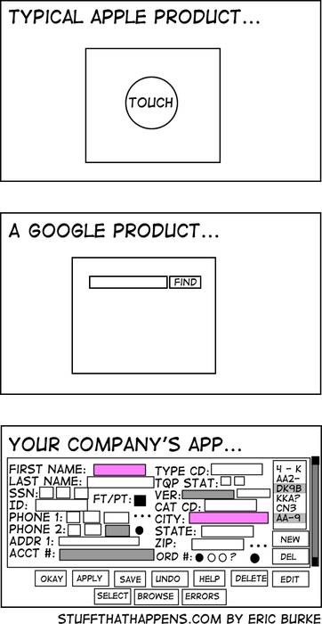

# My App

This application is designed to explore foundational functionalities of Expo, alongside integration with Storybook. It incorporates [a wide range of Expo components](https://github.com/trajano/expo-experiments/pull/2) to demonstrate their practical use.

## Key Features:

1. Expo Updates: Seamless app updates with expo-update.
2. Splash Screen: Displays a custom loader tied to the expo-update process.
3. In-App Update Alerts: Notifies users if a new update is available while the app is running.
4. Push Notifications: Handles push notification registration.
5. Send Notification: Functionality for sending push notifications.
6. Internationalization (i18n): Supports language switching.
7. Theme Switching: Toggle between dark and light modes.
8. Local Authentication: Implements local authentication features.
9. Google Authentication: (Potential feature)
10. Apple Authentication: (Potential feature)

## Future Enhancements:

1. Custom Expo Update Server: Possible addition as a separate package.

## What’s Included:

1. Expo Router Screens for page structuring.
2. Asset integration for media and resources.
3. Expose Expo, NetInfo, and React Native constants and state updates via Storybook screens.
4. Screen-level Storybook stories (potentially).

## Exclusions:

1. Components: Moved to the `react-native-my-components` package.
2. Component-level stories: Managed within `react-native-my-components`.

Certainly, Lord Archimedes. Here’s a refined version in Markdown format:

## App Router Layout

Certainly, Lord Archimedes. Here’s a simplified table format:

---

## App Router Layout

| Path                           | Description                      |
| ------------------------------ | -------------------------------- |
| `/_layout`                     | App setup                        |
| `/index`                       | Fancy splash screen              |
| `/storybook`                   | Storybook-related components     |
| `/+not-found`                  | The 404 page                     |
| **Unauthenticated Path**       |                                  |
| `/public/index`                | Login screen chooser             |
| `/public/sign-up`              | Optional sign-up screen          |
| `/public/terms-and-conditions` | Basically lorem ipsum            |
| **Authenticated Path**         |                                  |
| `/secure/(tabs)/`              | Tab switcher component           |
| `/secure/(tabs)/details/[id]`  | Dynamic route for detailed views |

## Comparing App Design Philosophies

The difference between a typical Apple product, a Google product, and "your company’s app" is that "your company’s app" is actually designed to perform work specific to your business needs. Thus, I would focus on streamlining the user experience for "your company’s app."
[]

### Approach to Streamlining "Your Company's App" UX

1. **Tabs Placement**

- On small devices, center the tabs evenly.
- On large devices, align tabs to the right to avoid excessive gaps.

2. **Drawer Usage**

- Use the drawer for a specific tab rather than as separate entries.
- This reduces the need for multiple steps to reach the desired content, improving flow.

3. **Tab Structure**

- Each tab should reflect a mode of operation:
  - **Dashboard**: Displays the main portfolio or case view.
  - **Search**: A general search page with no drawer.
  - **Me**: A personal settings area in a simple scroll view, without a drawer.

### Alternative Approach: Drawer-First Navigation

After evaluating the Deco app, a drawer-first approach may be more effective:

1. **Drawer Contents**

- Include account-specific elements and a link to settings.

2. **Tabs in Drawer**

- Retain the core tabs in the drawer, keeping it simple despite "file-based" navigation challenges:
  - **Dashboard**
  - **Search**
  - **Me**

### Observations

Regardless of approach, the main tabs remain consistent, which is beneficial for a streamlined experience. This concept fits a “caseworker” style app with an “administrative” focus, where caseworkers manage portfolios or cases, handle form data entries, and navigate through workflows.
